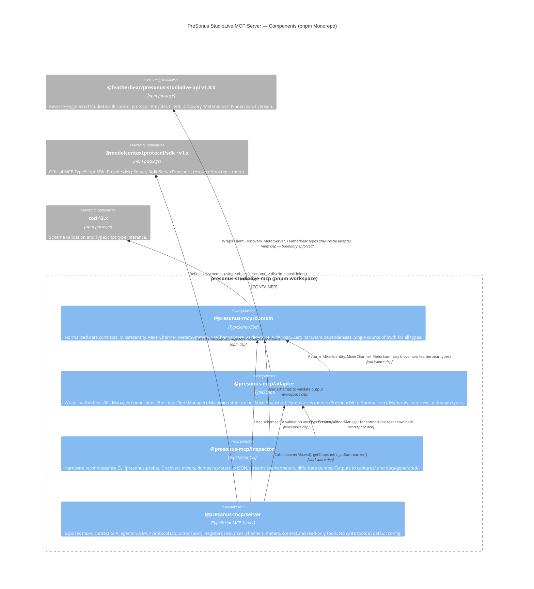

# Architecture Component Diagram (C4 Level 2)

**Standard**: ISO/IEC/IEEE 42010:2011 — Component/Container View
**Phase**: 03-Architecture
**Status**: Baselined v0.1 — 2026-06-24
**Architecture Decisions**: #7 (ADR-002) #8 (ADR-003) #9 (ADR-004)
**Components**: #11 (ARC-C-001) #12 (ARC-C-002) #13 (ARC-C-003) #14 (ARC-C-004)

---

## Package Dependency Diagram

This view shows the four packages that compose the system and their dependency relationships. The arrows represent compile-time dependencies enforced by `package.json`.



---

## Dependency Rules (Architecture Invariants)

These rules are enforced by the `package.json` dependency graph. Violating them is a build error.

| Package | MAY depend on | MUST NOT depend on |
|---------|--------------|-------------------|
| `presonus-domain` | `zod` | featherbear, MCP SDK, commander |
| `presonus-adapter` | `presonus-domain`, featherbear | MCP SDK, commander |
| `presonus-inspector` | `presonus-adapter`, `presonus-domain`, `commander` | MCP SDK |
| `presonus-mcp-server` | `presonus-adapter`, `presonus-domain`, MCP SDK, `zod` | featherbear directly |

**Rationale** (ADR-002 #7): The adapter boundary ensures featherbear internals never reach the MCP surface. If featherbear is replaced, only `presonus-adapter` needs changes.

---

## Build Order

TypeScript project references ensure correct build order:

```
presonus-domain
    └── presonus-adapter
            ├── presonus-inspector
            └── presonus-mcp-server
```

Command: `tsc --build` at repo root builds all packages in dependency order.

---

## Data Flow (Read Path — Soundcheck Diagnostics)

```mermaid
sequenceDiagram
    participant A as AI Agent
    participant S as presonus-mcp-server
    participant Adp as presonus-adapter
    participant FB as featherbear Client
    participant M as StudioLive 32SC

    Note over FB,M: Connection already established; state cache populated
    A->>S: Read presonus://mixer/FOH-32SC/channels
    S->>Adp: getSnapshot("serial:ABC123")
    Adp-->>S: MixerSnapshot { channels: MixerChannel[], ... }
    S-->>A: JSON array of MixerChannel objects (validates against MixerChannelSchema)

    Note over M,FB: Engineer mutes LINE:1 in UC Surface
    M--)FB: data event { "line.ch1.mute": true }
    FB--)Adp: "data" event
    Adp->>Adp: mapRawStateToSnapshot() → update snapshot
    Note over Adp: Within 500ms (REQ-NF-003 #23)

    A->>S: Read presonus://mixer/FOH-32SC/channels (again)
    S->>Adp: getSnapshot("serial:ABC123")
    Adp-->>S: Updated snapshot { channels[0].mute: true }
    S-->>A: LINE:1 now shows mute: true
```

---

## captures/ vs test/fixtures/ Separation

| Directory | Purpose | Committed? |
|-----------|---------|-----------|
| `captures/` | Runtime probe output from real hardware | No (gitignored) |
| `test/fixtures/` | Curated golden files for unit tests | Yes |
| `docs/generated/` | Human-edited state-key-map.md derived from captures | Yes (after probe run) |
