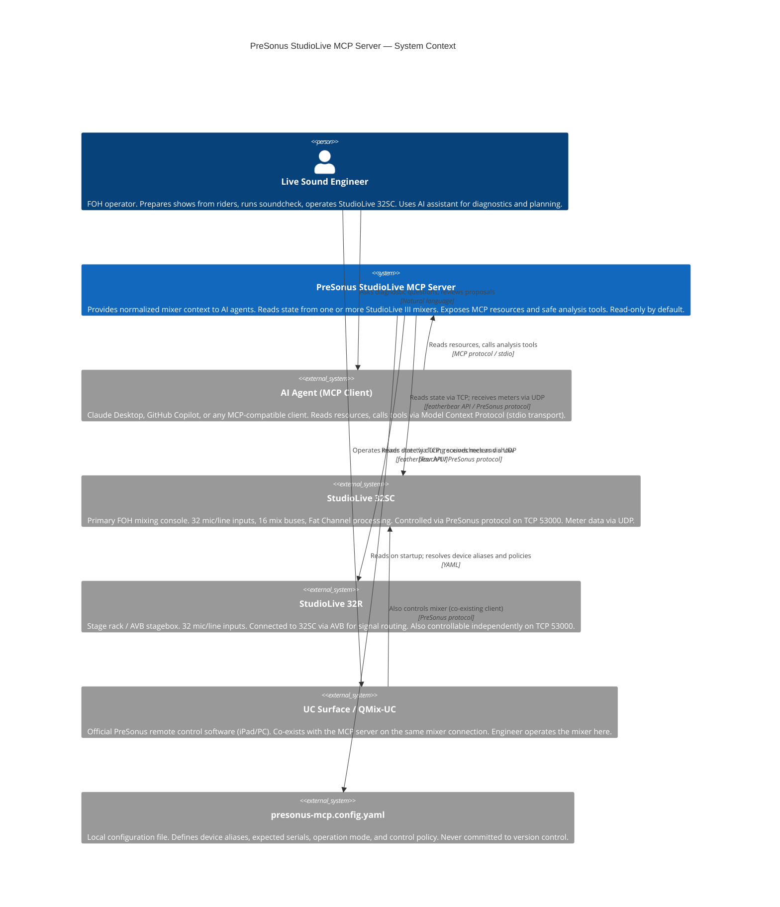

# Architecture Context Diagram (C4 Level 1)

**Standard**: ISO/IEC/IEEE 42010:2011 — System Context View
**Phase**: 03-Architecture
**Status**: Baselined v0.1 — 2026-06-24
**Architecture Decisions**: #6 (ADR-001) #7 (ADR-002) #9 (ADR-004) #10 (ADR-005)
**Stakeholder Requirements**: #1 #2 #3 #4 #5

---

## System Context

This view shows the `presonus-studiolive-mcp` system in its operational environment, identifying all external actors and their relationships to the system.

---

## Key Constraints Visible at System Boundary

| Constraint | Direction | Detail |
|-----------|-----------|--------|
| Read-only default | MCP Server → Mixer | No write tools in default config (#10, #22) |
| Serial-based identity | MCP Server → Mixer | Device ID derived from serial, not IP (#16) |
| No autonomous mixing | AI Agent → MCP Server | Write tools not registered in MVP (#5, #10) |
| Co-existence | UC Surface ↔ Mixer | MCP server does not interfere with UC Surface |
| Local LAN only | All | No internet connectivity assumed; server not publicly exposed |
| stdio transport | AI Agent ↔ MCP Server | Server communicates via stdin/stdout; no HTTP binding in MVP |

---

## Bounded Context

The system operates within a single **Bounded Context**: the Live Event Audio Production domain.

Key domain terms used at this boundary (see `02-requirements/ubiquitous-language.md`):
- **FOH** — The role of the StudioLive 32SC
- **Stagebox** — The role of the StudioLive 32R
- **MixerIdentity** — How each device is identified by the system
- **OperationMode** — How the system constrains its behavior (prepare / soundcheck_assist / control_locked)
- **MCP Resource** — Read-only data exposed to the AI agent
- **MCP Tool** — Callable analysis action (never direct mixer control in MVP)
