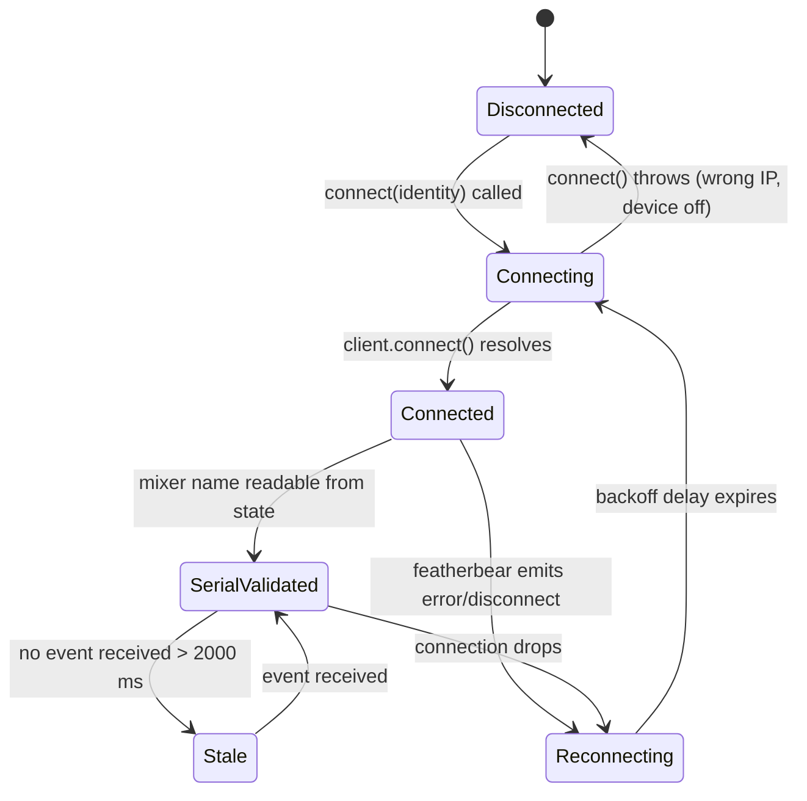

# Detailed Design: presonus-adapter — Hardware Adapter Layer

**Standard**: IEEE 1016-2009 (Software Design Description)
**Phase**: 04-Design
**Status**: Baselined v0.1 — 2026-06-24
**Architecture Component**: #12 (ARC-C-002)
**Architecture Decisions**: #7 (ADR-002), #8 (ADR-003), #9 (ADR-004), #10 (ADR-005)
**Requirements**: #15 #16 #17 #18 #23 #24
**Source**: `packages/presonus-adapter/src/`

---

## 1. Purpose

The adapter package is the isolation boundary between the raw featherbear protocol layer and the normalized domain model. It translates `@featherbear/presonus-studiolive-api` types into `@presonus-mcp/domain` types. Featherbear types never escape this package.

**Critical constraint**: Write methods from featherbear (`mute()`, `setFader()`, `recallScene()`, etc.) are deliberately not exposed in any adapter API. Read-only by design (ADR-005 #10).

---

## 2. Discovery Flow

```mermaid
sequenceDiagram
    participant Caller as presonus-mcp-server or presonus-inspector
    participant Disc as discoverMixers()
    participant FB as featherbear Discovery
    participant Net as Local Network

    Caller->>Disc: discoverMixers({ timeoutMs: 5000, fallbackDevices: [...] })
    Disc->>FB: new Discovery(); discovery.start()
    FB->>Net: UDP broadcast (PreSonus discovery packet)
    Net-->>FB: Response from 32SC (name, serial, ip, port)
    Net-->>FB: Response from 32R (name, serial, ip, port)
    FB-->>Disc: "discover" event × 2
    Disc->>Disc: normalizeDiscoveredDevice() for each
    Note over Disc: timeout expires after 5000 ms
    Disc->>Disc: Check for missing configured devices → try fallback IPs
    Disc-->>Caller: DiscoveryResult { devices, missingConfigured, unknownDiscovered }
```

### Identity Priority (REQ-F-002 #16)

```
if serial is present:
    deviceId = "serial:<serial>"
    confidence = "observed"
elif configured alias + expectedSerial match:
    deviceId = "alias:<alias>"
    confidence = "configured"
else:
    deviceId = "ip:<ip>:<port>"
    confidence = "fallback"
```

---

## 3. Connection Lifecycle



**On connect**: `dumpState()` is called to populate the initial snapshot. Event subscription begins.  
**On serial mismatch**: Device added to inventory with `role: "UNKNOWN"`, `controllable: false`. Warning logged.  
**On disconnect**: Snapshot is preserved (not cleared). `connected = false`. Stale flag set.  
**Reconnect backoff**: 1s, 2s, 4s, 8s, 16s, 30s (cap). Never exponential past 30s.

---

## 4. State Mapping Algorithm

### 4.1 Key Pattern Detection

The state mapper discovers channel numbers from the raw state tree by matching the mute key pattern:

```
/^line\.ch(\d+)\.mute$/ → extract channel number N
```

This avoids hardcoding channel count (32SC has 32 LINE channels; firmware may expose more/fewer at different times).

### 4.2 Per-Channel Extraction

For each discovered channel N, the mapper reads:

```
line.chN.name    → MixerChannel.name
line.chN.mute    → MixerChannel.mute
line.chN.solo    → MixerChannel.solo
line.chN.volume  → MixerChannel.fader.linear (clamped 0–100)
line.chN.pan     → MixerChannel.pan (clamped 0–100)
line.chN.link    → MixerChannel.linked
line.chN.color   → MixerChannel.color
```

⚠️ **All key suffixes above are UNVERIFIED** (marked in `types.ts` as `KNOWN_CHANNEL_KEY_SUFFIXES`, confidence: documented). They must be confirmed by `presonus-probe dump-state` + `diff-state` on physical hardware. See `docs/generated/state-key-map.md` (populated after first probe run).

### 4.3 Unknown Key Preservation

Any key matching `line.chN.*` that is not in the known suffix set is stored in `MixerChannel.rawExtra`. This includes:
- Future firmware keys
- Fat Channel parameter keys (not yet mapped)
- Feature-flagged or model-specific keys

Unknown keys **never cause a parse error**. The adapter degrades gracefully.

---

## 5. Meter Summarization Algorithm

### 5.1 Data Flow

```
featherbear "meter" event
    → raw packet: { channels: number[], timestamp: number }
    → PresonusMeterSummarizer.ingest()
    → ring buffer (max 60 s)

getSummary(windowSec: 1 | 10 | 60)
    → filter entries within window
    → for each channel index: compute max value in window
    → classify each max value → GainHint
    → produce MeterSummary
```

### 5.2 Ring Buffer Design

- Entries older than `bufferMaxMs` (default 60,000 ms) are evicted on each `ingest()` call
- Eviction is O(n) worst case but n is bounded by the number of meter events in 60 s (typically ~60–200 entries)
- Memory footprint: small (each entry is `{ channels: number[], timestamp: number }`)

### 5.3 GainHint Classification

Thresholds are approximate pending empirical calibration:

| Raw value | GainHint | Approximate dBFS |
|-----------|---------|-----------------|
| ≥ 250 | `clipping` | ≈ 0 dBFS |
| ≥ 220 | `hot` | ≈ -3 dBFS |
| ≥ 100 | `ok` | ≈ -12 dBFS |
| ≥ 10 | `low` | ≈ -40 dBFS |
| < 10 | `no-signal` | below -40 dBFS |

⚠️ **These thresholds are guesses**. They must be calibrated using `presonus-probe watch-meters` combined with known input levels on physical hardware.

---

## 6. Error Handling Policy

| Error condition | Adapter behavior |
|----------------|-----------------|
| Connection refused (wrong IP) | Log to stderr; set `connected: false`; schedule reconnect |
| Serial mismatch after connect | Log warning; set `role: "UNKNOWN"`, `controllable: false` |
| `dumpState()` throws | Log warning; continue with empty initial state; events will populate cache |
| Unknown state key | Preserve in `rawExtra`; no error or warning |
| Meter event with unexpected shape | Log warning; skip entry; don't crash |
| Reconnect fails repeatedly | Log error each attempt; keep trying with backoff cap |

---

## 7. Read-Only Enforcement

The `PresonusClientManager` class deliberately does **not** expose write methods. The internal `conn.client` field (featherbear `Client`) is typed as `any` to avoid TypeScript from surfacing its write methods through inference. 

This is intentional: the adapter's public TypeScript interface contains only:
- `connect(identity)` — establishes connection
- `disconnect(deviceId)` — closes connection
- `getSnapshot(deviceId)` — returns read-only snapshot
- `getSummarizer(deviceId)` — returns meter summarizer
- `getConnectedDeviceIds()` — lists active connections
- `getIdentity(deviceId)` — returns identity for a device

No method named `mute`, `setFader`, `recallScene`, `setColor`, or similar exists on this class.

---

## Phase 04 Amendment — Routing Extraction Design (ADR-008)

**Added**: 2026-06-25  
**Requirements**: #39 (REQ-F-ROUT-009), #40 (REQ-F-ROUT-010)  
**Architecture**: #47 (ADR-008)

### Bug fix: `extractAuxMixes` regex

**Current (incorrect)**: `^line\.ch(\d+)\.aux\.ch(\d+)$` — matches `line.ch1.aux.ch2` which does not exist.

**Corrected**: `^(?:line|return|fxreturn|talkback)\.ch(\d+)\.aux(\d+)$` — matches `line.ch1.aux1` (observed on 32SC).

Also fix muted detection — current code checks `line.chN.aux.chM.mute` (non-existent key). Correct: use `${prefix}.assign_aux${M}` where `0` = not assigned = effectively muted.

### FX send assignment extraction (REQ-F-ROUT-009)

In `extractChannelSendRouting()`, for each FX bus (FXA–FXH):

```typescript
const assignRaw = f(`.assign_${bus}`)  // e.g. line.ch1.assign_FXA (inferred key)
const assigned = assignRaw !== undefined
  ? (typeof assignRaw === 'boolean' ? assignRaw : (assignRaw as number) !== 0)
  : undefined
```

Key pattern `assign_FXA` is inferred (not probe-confirmed). `FxSend.assigned` is optional; absent when key not in state.

### Non-LINE channel routing (REQ-F-ROUT-010)

Extend `extractAuxMixes()` to match channel prefixes: `line`, `return`, `fxreturn`, `talkback`.

`fromChannelName` derivation order:
1. `flat[\`${prefix}.username\`]`
2. `flat[\`${prefix}.name\`]`
3. Type-based default: `"FX Ret N"`, `"Talkback"`, `"Return N"`

### `parameterConfidence` rename

`'guessed'` → `'inferred'` in two places: `extractChannelSendRouting()` and `extractFatChannelState()`.

### Tests to add/update

| Test file | Coverage |
|-----------|----------|
| `routing.test.ts` | FX assign present → `assigned: true`; absent → `undefined` |
| `routing.test.ts` | `parameterConfidence: 'inferred'` |
| `state-mapper.test.ts` | `parameterConfidence: 'inferred'` |
| `aux-mix.test.ts` (new) | `extractAuxMixes` with `aux1` key; FXRETURN and TALKBACK sends included |
