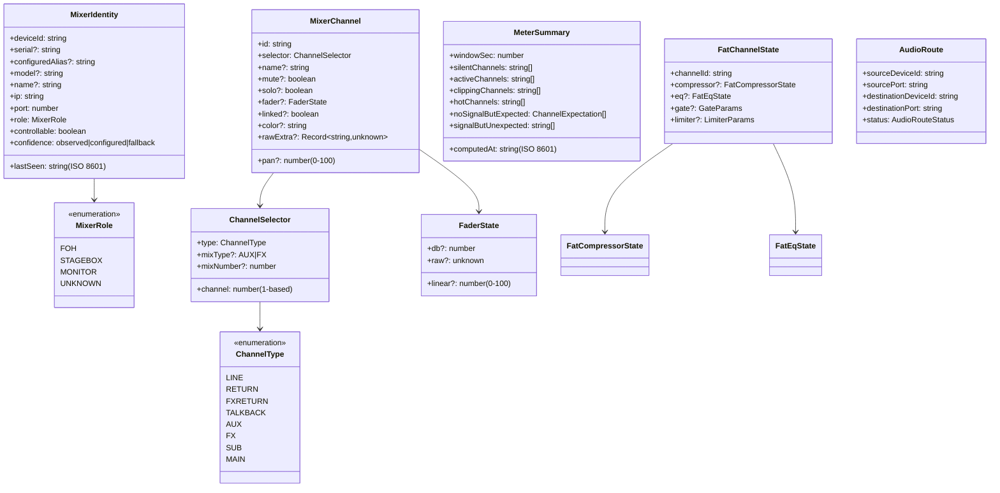

# Detailed Design: presonus-domain — Normalized Domain Schemas

**Standard**: IEEE 1016-2009 (Software Design Description)
**Phase**: 04-Design
**Status**: Baselined v0.1 — 2026-06-24
**Architecture Component**: #11 (ARC-C-001)
**Architecture Decisions**: #7 (ADR-002: Three-layer architecture), #8 (ADR-003: pnpm monorepo)
**Requirements**: #15 #16 #17 #18 #19 #20 #21 #22 #23
**Source**: `packages/presonus-domain/src/schemas/`

---

## 1. Purpose

The `@presonus-mcp/domain` package is the single source of truth for all normalized data types in the system. It has zero runtime dependencies except `zod`, making it independently testable and portable.

All schemas use Zod v3. Inferred TypeScript types are exported alongside schemas.

---

## 2. Schema Hierarchy



---

## 3. Key Design Decisions

### 3.1 Discriminated Union for FatChannel Models

Fat Channel compressor and EQ models are discriminated by a `model` field. This allows each model's specific parameters to be typed independently.

```typescript
// Each model has its own parameter set — no "universal compressor params" object
const BritCompParamsSchema = z.object({
  model: z.literal('BRIT_COMP'),
  thresholdDb: z.number().optional(),
  keyFilterHz: z.number().optional(),   // Only Brit Comp has this
  // ...
})

const FatCompressorStateSchema = z.discriminatedUnion('model', [
  StandardCompParamsSchema,
  BritCompParamsSchema,
  UnknownCompParamsSchema,  // Fallback for unrecognized models
])
```

**Rationale**: Different compressor models expose different controls in UC Surface. A flat "all compressor params" object would have many nullable fields with no constraint on which fields are meaningful for a given model. The discriminated union makes model-specific parameters explicit and verifiable.

### 3.2 `rawExtra` Field for Unknown Keys

Every `MixerChannel` has an optional `rawExtra: Record<string, unknown>` field. The state mapper populates this with any raw state keys that don't match known mappings.

**Rationale**: The featherbear API is partly empirical. Firmware updates may add new keys. If unknown keys cause schema parse failures, the MCP server would break on firmware upgrades. The `rawExtra` escape hatch preserves unknown data without breaking validation.

### 3.3 `confidence` Field on FatModelRef

All Fat Channel model references carry a `confidence` level (`"documented"`, `"observed"`, `"guessed"`, `"unknown"`). Raw numeric model IDs are not hardcoded until verified by `presonus-probe probe-fat-channel` on physical hardware.

**Rationale**: The featherbear docs show model names but not their raw integer IDs. Guessing IDs risks mapping the wrong compressor model to the wrong parameter set. Better to store `confidence: "unverified"` and log a warning than silently miscategorize.

### 3.4 `pan` Range: 0–100 (not -100 to +100)

Pan is represented as 0–100 where 50 = center, 0 = full left, 100 = full right. This matches common mixer conventions (not audio engineering dBFS conventions).

---

## 4. Validation Rules Summary

| Schema | Key Rules |
|--------|-----------|
| `MixerIdentitySchema` | `port` must be integer; `lastSeen` must be ISO 8601 datetime; `role` must be valid enum |
| `ChannelSelectorSchema` | `channel` must be positive integer (≥ 1) |
| `MixerChannelSchema` | `pan` must be 0–100 inclusive; `fader.db` may be null (not yet calibrated) |
| `MeterSummarySchema` | `windowSec` must be positive; `computedAt` must be ISO 8601 datetime |
| `FatCompressorStateSchema` | Discriminated by `model`; UNKNOWN requires `rawModelId` and `rawParams` |
| `AudioRouteSchema` | `status` must be one of the five defined values |

---

## 5. Test Strategy

Unit tests in `packages/presonus-domain/src/__tests__/`:

| Test file | Coverage |
|-----------|---------|
| `mixer.test.ts` | Parse valid/invalid MixerIdentity; role enum; overview |
| `channel.test.ts` | Parse all ChannelTypes; selector validation; mute/fader/pan ranges; rawExtra preservation |
| `metering.test.ts` | GainHint values; MeterSummary parsing; noSignalButExpected structure |

**Principle**: Tests define the contract before the adapter uses these schemas. If a test breaks, either the schema or the caller is wrong — not both.

---

## Phase 04 Amendment — Routing Layer Types (ADR-008)

**Added**: 2026-06-25  
**Requirements**: #38 (REQ-F-ROUT-008), #44 (REQ-F-AUX-005)  
**Architecture**: #47 (ADR-008: Two-layer routing model)

### New schemas in `routing.ts`

#### `RoutingKind` (Value Object — enum)

| Kind | Layer | Description |
|------|-------|-------------|
| `channel-to-aux` | A | LINE channel → AUX bus |
| `channel-to-fx` | A | LINE channel → FX bus |
| `fx-return-to-aux` | A | FX Return channel → AUX bus |
| `talkback-to-aux` | A | TALKBACK channel → AUX bus |
| `input-source` | B | Physical input → console channel |
| `bus-to-output` | B | AUX/SUB/FX bus → analog output |
| `avb-stream` | B | AVB network stream mapping |
| `stagebox` | B | Stagebox input mapping |

#### `MixerRoute` (Value Object)

All fields except `kind`, `source`, `destination`, `confidence` are optional — absence means "key not in state".

```
MixerRoute {
  kind: RoutingKind
  source: string           // state prefix, e.g. "line.ch1"
  destination: string      // state prefix, e.g. "aux.ch3"
  level?: number           // 0.0–1.0 send level
  assigned?: boolean       // send enabled/assigned
  muted?: boolean          // source channel muted
  rawPath?: string         // state key read from
  rawValue?: unknown
  confidence: RoutingConfidence
}
```

#### `MixerRoutingGraph` (Aggregate for routing view)

```
MixerRoutingGraph {
  deviceId: string
  capturedAt: ISO 8601
  routes: MixerRoute[]
  summary: {
    byKind: Record<RoutingKind, number>
    observed: number
    inferred: number
    not_verifiable: number
  }
}
```

#### `RoutingConfidence` rename

`'guessed'` → `'inferred'`. fat-channel.ts `ConfidenceSchema` unchanged.

### New schemas in `mixauxes.ts`

#### `AuxMixAuditIssue` (Value Object)

```
AuxMixAuditIssue {
  issueType: 'unassigned_send'|'muted_send'|'very_low_send'|'hot_send'|'master_muted'
  auxMixNumber: number
  channel: number
  channelName: string
  severity: 'high'|'medium'|'low'
  detail: string
  level?: number
  levelDb?: number | null
}
```

#### `AuxMixAuditResult` (Value Object)

```
AuxMixAuditResult {
  auxMixNumber: number
  name: string
  masterLevel: number
  masterMuted: boolean
  sendCount: number
  status: 'ok'|'warning'|'problem'
  issues: AuxMixAuditIssue[]
  hotThresholdDb: number         // default: -6 dBFS
}
```

`HOT_SEND_THRESHOLD_DB = -6` constant exported from `mixauxes.ts`.

### Tests to add

| Test file | New coverage |
|-----------|-------------|
| `routing.test.ts` | RoutingKind all 8 values; MixerRoute optional fields; MixerRoutingGraph summary |
| `monitor-aux.test.ts` | AuxMixAuditIssue all 5 types; AuxMixAuditResult status aggregation |
