# Detailed Design: presonus-inspector — Probe CLI

**Standard**: IEEE 1016-2009 (Software Design Description)
**Phase**: 04-Design
**Status**: Baselined v0.1 — 2026-06-24
**Architecture Component**: #13 (ARC-C-003)
**Architecture Decisions**: #7 (ADR-002), #8 (ADR-003)
**Requirements**: #20 (REQ-F-006: probe CLI state dump)
**Source**: `packages/presonus-inspector/src/cli/`

---

## 1. Purpose

The inspector CLI (`presonus-probe`) is a **development tool**, not a production artifact. It connects to real hardware to discover the empirical PreSonus API surface: exact state key names, value types, channel counts, Fat Channel model codes, and meter data layout. Its outputs become the foundation for the state mapper and domain schemas.

**First milestone**: `pnpm probe:dev discover` finds the physical 32SC on the network → proves the adapter layer compiles and connects.

**Second milestone**: `pnpm probe:dev dump-state --device <ip>` produces `captures/<date>/<serial>/state-full.json` → proves REQ-F-006 (#20) and gives raw data for state-key-map.md.

---

## 2. Command Structure

```mermaid
graph TD
    A[presonus-probe] --> B[discover]
    A --> C[dump-state]
    A --> D[watch-events]
    A --> E[watch-meters]
    A --> F[diff-state]
    A --> G[probe-fat-channel]

    B --> B1["--timeout &lt;ms&gt; (default 5000)"]
    B --> B2[--json]
    B --> B3["--out &lt;file&gt;"]

    C --> C1["--device &lt;serial|ip&gt; (required)"]
    C --> C2["--port &lt;port&gt; (default 53000)"]
    C --> C3["--out &lt;file&gt;"]
    C --> C4[--print-keys]

    D --> D1["--device (required)"]
    D --> D2["--seconds &lt;N&gt; (default 60)"]
    D --> D3["--out &lt;file&gt;"]

    E --> E1["--device (required)"]
    E --> E2["--seconds &lt;N&gt; (default 30)"]
    E --> E3["--out &lt;file&gt;"]

    F --> F1["--before &lt;file&gt; (required)"]
    F --> F2["--after &lt;file&gt; (required)"]
    F --> F3["--out &lt;file&gt;"]

    G --> G1["--device (required)"]
    G --> G2["--channel (e.g. LINE:1)"]
```



---

## 3. Data Flow: dump-state (Primary Command)

```mermaid
flowchart TD
    A[CLI invoked: presonus-probe dump-state --device 192.168.10.50] --> B[Parse args with commander]
    B --> C[Dynamic import: featherbear Client]
    C --> D["new Client({ host, port: 53000 })"]
    D --> E[await client.connect()]
    E --> F{connect OK?}
    F -- No --> G[stderr: Connection failed; exit 1]
    F -- Yes --> H[Wait 2s for initial state population]
    H --> I[await client.dumpState()]
    I --> J{dumpState available?}
    J -- Yes --> K[rawState = dumpState() result]
    J -- No --> L[rawState = client.state._data]
    K --> M[Merge with client.state._data]
    L --> M
    M --> N[Build output JSON: mixer metadata + state]
    N --> O{keyCount >= 50?}
    O -- No --> P[stderr warning: state may be incomplete]
    O -- Yes --> Q[stdout: summary]
    P --> Q
    Q --> R[mkdir captures/date/serial/]
    R --> S[writeFile: state-full.json]
    S --> T[client.close()]
    T --> U[stdout: output file path]
```

---

## 4. Output Format Specification

### captures/<date>/<serial>/state-full.json

```json
{
  "mixer": {
    "name": "StudioLive 32SC",
    "serial": "ABC123",
    "firmware": "6.7.0.94665",
    "host": "192.168.10.50",
    "port": 53000
  },
  "capturedAt": "2026-06-24T14:30:00.000Z",
  "stateKeyCount": 487,
  "state": {
    "global.mixer_name": "StudioLive 32SC",
    "line.ch1.mute": false,
    "line.ch1.name": "Ch 1",
    "line.ch1.volume": 67.5,
    ...
  }
}
```

### captures/<date>/<serial>/events.jsonl (NDJSON)

```
{"ts":"2026-06-24T14:30:01.000Z","event":"data","data":{"line.ch1.mute":true}}
{"ts":"2026-06-24T14:30:01.050Z","event":"data","data":{"line.ch1.mute":true}}
```

### captures/<date>/<serial>/meters.jsonl (NDJSON)

```
{"ts":"2026-06-24T14:30:00.050Z","meter":{"channels":[120,85,0,0,...]}}
{"ts":"2026-06-24T14:30:00.083Z","meter":{"channels":[118,87,0,0,...]}}
```

---

## 5. diff-state: State Key Change Detection

The `diff-state` command enables the probe workflow for discovering state keys:

```
Workflow: make one change in UC Surface → dump-state before → dump-state after → diff-state
```

Algorithm:
1. Load `before.json` and `after.json` state objects
2. For each key in `after.state`: if key absent in `before.state` → "added"
3. For each key in `before.state`: if key absent in `after.state` → "removed"  
4. For each key in both: if value differs → "changed" (show before/after)
5. Output: human-readable table + optional `docs/generated/state-key-changes.md`

---

## 6. Output Directory Policy

| Directory | Purpose | Committed? |
|-----------|---------|-----------|
| `captures/` | All runtime probe output | No (`captures/**/*.json` gitignored) |
| `captures/.gitkeep` | Keeps directory in git | Yes |
| `test/fixtures/32sc/` | Curated golden files for unit tests | Yes |
| `test/fixtures/32r/` | Curated golden files for 32R | Yes |
| `docs/generated/state-key-map.md` | Manual table: raw key → domain field | Yes (after first probe run) |
| `docs/generated/fat-channel-enum-map.md` | Manual table: model name → raw value | Yes (after probe-fat-channel run) |

**Process**: After running probe CLI on real hardware, manually review captures and update the `docs/generated/` files. Then update state mapper key constants and adapter tests to match.
