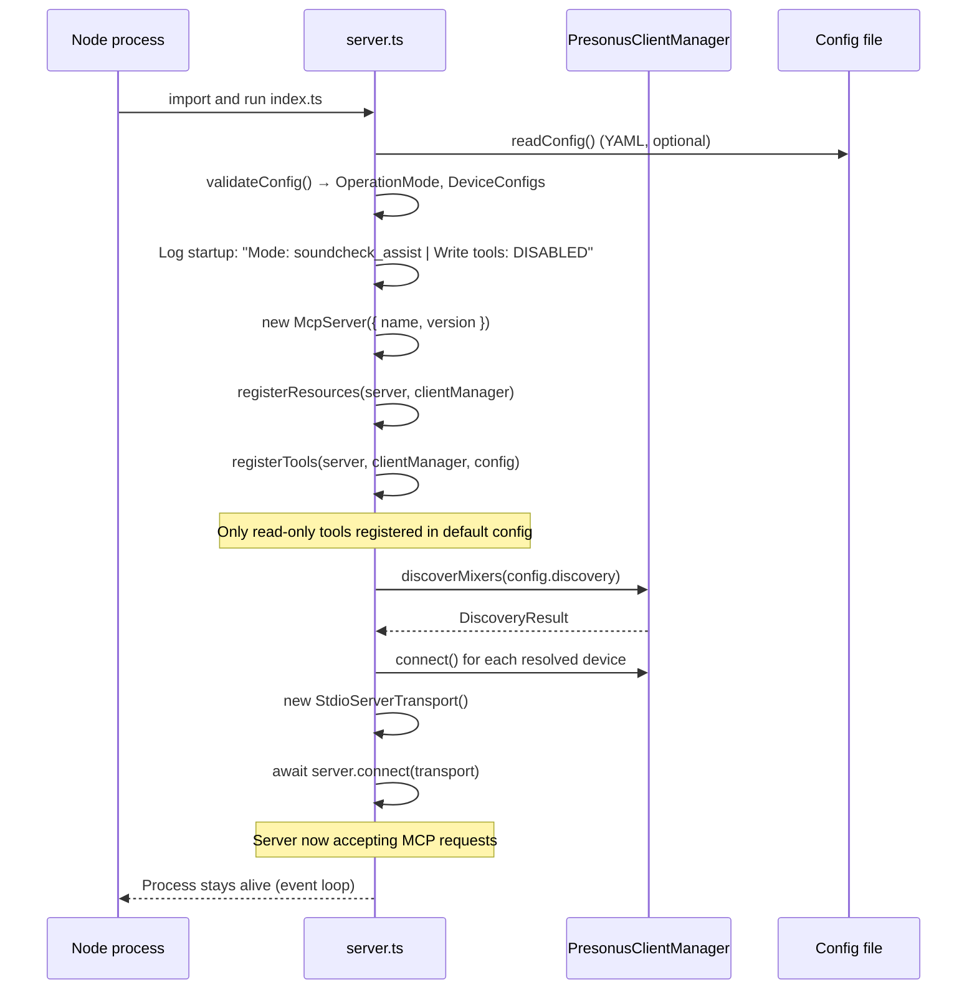

# Detailed Design: presonus-mcp-server — MCP Server

**Standard**: IEEE 1016-2009 (Software Design Description)
**Phase**: 04-Design
**Status**: Baselined v0.1 — 2026-06-24
**Architecture Component**: #14 (ARC-C-004)
**Architecture Decisions**: #6 (ADR-001), #7 (ADR-002), #8 (ADR-003), #10 (ADR-005)
**Requirements**: #17 #18 #19 #21 #22 #23 #24
**Source**: `packages/presonus-mcp-server/src/`

---

## 1. Purpose

The MCP server is the deployed artifact consumed by AI agents. It exposes normalized mixer context as MCP resources and safe analysis tools via the `@modelcontextprotocol/sdk` with a stdio transport. All data served from the state cache — no synchronous mixer queries per request.

---

## 2. MCP Resource Catalog

| URI | Returns | Schema | Stale-safe? |
|-----|---------|--------|-------------|
| `presonus://mixers` | All discovered mixers | `MixerIdentity[]` | Yes (empty if none) |
| `presonus://mixer/{id}/overview` | Mixer name, model, serial, role, firmware | `MixerOverview` | Yes |
| `presonus://mixer/{id}/channels` | All channels with state | `MixerChannel[]` | Yes (with stale flag) |
| `presonus://mixer/{id}/scene/current` | Current project + scene + available projects | `SceneResource` | Yes |
| `presonus://mixer/{id}/meters/summary` | 10s meter summary | `MeterSummary` | Yes (empty arrays if no meter data) |
| `presonus://mixer/{id}/raw/state` | Full raw state tree (diagnostic only) | `Record<string, unknown>` | Yes |

All resources return valid JSON even when the mixer is disconnected (using last-known cached state).

---

## 3. MCP Tool Catalog (MVP — Read-Only Only)

| Tool | Input Schema | Output | Mutates? | Registered in default config? |
|------|-------------|--------|----------|------------------------------|
| `discover_mixers` | `{ timeoutMs?: number }` | `MixerIdentity[]` | No | Yes |
| `refresh_mixer_state` | `{ deviceId: string }` | `{ success: boolean, channelCount: number }` | No | Yes |
| `validate_mixer_identity` | `{ deviceId: string, expectedSerial?: string, expectedRole?: string }` | `{ valid: boolean, reasons: string[] }` | No | Yes |

**Write tools** (`set_fader`, `set_mute`, `recall_scene`, `apply_change_set`): **NOT registered in MVP**.  
Per ADR-005 (#10) and REQ-NF-002 (#22): write tools are registered only when `controlEnabled: true` in config AND `operationMode !== control_locked`. That condition is never true in MVP.

---

## 4. Operation Mode State Machine

```mermaid
stateDiagram-v2
    [*] --> ReadFromConfig : Server starts
    ReadFromConfig --> Prepare : operationMode = prepare
    ReadFromConfig --> SoundcheckAssist : operationMode = soundcheck_assist (default)
    ReadFromConfig --> ControlLocked : operationMode = control_locked

    Prepare --> Prepare : Resources available; analysis tools available; no write tools
    SoundcheckAssist --> SoundcheckAssist : Same as Prepare; meter summarizer active
    ControlLocked --> ControlLocked : Resources available; ALL write tools disabled regardless of controlEnabled

    note right of ControlLocked
        controlEnabled: true has no effect
        in control_locked mode.
        Write tools remain unregistered.
    end note
```



---

## 5. Configuration Schema (presonus-mcp.config.yaml)

```yaml
# Operation mode: prepare | soundcheck_assist | control_locked
# Default: soundcheck_assist
operationMode: soundcheck_assist

discovery:
  enabled: true
  timeoutMs: 5000
  rescanIntervalSec: 30          # 0 = no periodic rescan

# Device aliases (optional — for stable identity and role assignment)
devices:
  - alias: FOH-32SC
    expectedSerial: ""           # Fill from first probe run
    fallbackIp: ""               # Fill with static IP if DHCP changes
    fallbackPort: 53000
    role: FOH
    allowControl: false          # Always false in MVP

  - alias: Stagebox-32R
    expectedSerial: ""
    fallbackIp: ""
    role: STAGEBOX
    allowControl: false

# Control policy (applies globally, not per-device)
control:
  defaultWriteAccess: false      # Must remain false in MVP
  allowDuringShow: false
  allowSceneRecall: false
  allowFaderMoves: false
  allowMuteChanges: false

# Logging
logging:
  level: info                    # debug | info | warn | error
  staleStateWarningMs: 2000      # Log warning if no mixer event for this long
```

---

## 6. Startup Sequence



---

## 7. Resource Handler Design

All resource handlers follow this pattern:

```typescript
// Pattern: read from cache; return typed domain object; never query mixer synchronously
server.resource("mixer-channels", new ResourceTemplate("presonus://mixer/{deviceId}/channels", {}),
  async (uri, { deviceId }) => {
    const snapshot = clientManager.getSnapshot(deviceId)
    if (!snapshot) {
      return { contents: [{ uri: uri.href, text: JSON.stringify([]), mimeType: "application/json" }] }
    }
    const channels = MixerChannelSchema.array().parse(snapshot.channels)
    return { contents: [{ uri: uri.href, text: JSON.stringify(channels), mimeType: "application/json" }] }
  }
)
```

**Key properties**:
- Never `await` a mixer operation inside a resource handler
- Always return valid JSON even on empty/stale state
- Validate output against domain schema before returning

---

## 8. Testing Strategy

| Test type | What | File |
|-----------|------|------|
| Unit | Tool input schemas reject invalid args | `src/__tests__/tools.test.ts` |
| Unit | Server registers correct tool count in default config | `src/__tests__/server.test.ts` |
| Contract | Resource output validates against domain schemas | `src/__tests__/resources.test.ts` |
| Integration | MCP Inspector connects; lists resources and tools | Manual + HIL |

**REQ-NF-002 enforcement**: The test `server.test.ts` must assert that zero write tools are registered when the server is instantiated with no config or with `controlEnabled: false`. This test runs in CI on every PR.

---

## Phase 04 Amendment — Layer A + Layer B Routing (ADR-008)

**Added**: 2026-06-25  
**Requirements**: #41–#44 (REQ-F-AUX-002–005), #45 (REQ-F-ROUT-011)  
**Architecture**: #47 (ADR-008)

### New Layer A tools

| Tool | Input | Output |
|------|-------|--------|
| `find_missing_monitor_sends` | `{deviceId, auxMixNumber}` | `{auxMixNumber, status, missingSends[]}` |
| `find_muted_monitor_sends` | `{deviceId, auxMixNumber}` | `{auxMixNumber, status, mutedSends[]}` |
| `find_hot_monitor_sends` | `{deviceId, auxMixNumber, thresholdDb?=-6}` | `{auxMixNumber, thresholdDb, status, hotSends[]}` |
| `validate_aux_mix` | `{deviceId, auxMixNumber, hotThresholdDb?=-6}` | `AuxMixAuditResult` |

All four call `extractAuxMixes(snapshot.flatState)` from `@presonus-mcp/adapter`.

`validate_aux_mix` runs missing + muted + hot sub-audits, adds `master_muted` issue when master is muted, aggregates status: any `severity:high` → `problem`.

### New Layer B stubs

```typescript
{
  status: 'not_verifiable_with_current_adapter' | 'partial',
  reason: string,
  probeSteps: string[],
  probeMarkdown: string,
}
```

| Tool | Status | Notes |
|------|--------|-------|
| `get_input_routing` | `not_verifiable_with_current_adapter` | Pure stub |
| `validate_avb_routing` | `not_verifiable_with_current_adapter` | Pure stub |
| `validate_output_routing` | `partial` | Returns OutputPatchRouter (index known, sourceName=null) + unverified block |

### New Layer A resources

| URI | Returns |
|-----|---------|
| `presonus://mixer/{id}/fx-sends` | Per-channel FxSend arrays |
| `presonus://mixer/{id}/monitor-routing` | `MixerRoutingGraph` (all channel→AUX sends as MixerRoute[]) |

`monitor-routing` construction: for each AuxMix, for each send, emit a `MixerRoute` with `kind` from channel prefix (`line.*` → `channel-to-aux`; `fxreturn.*` → `fx-return-to-aux`; etc.), `confidence: 'inferred'`.
